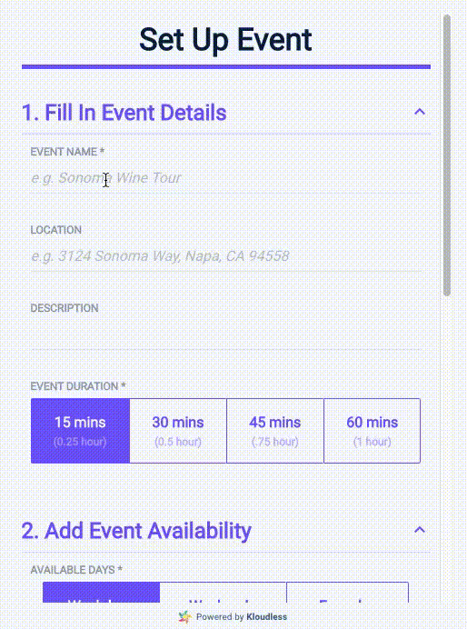
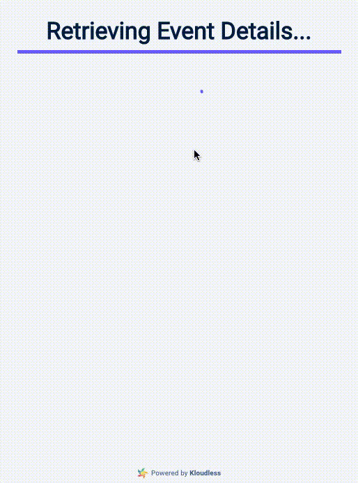

# Kloudless Meeting Scheduler

The Kloudless Meeting Scheduler is a JavaScript library that allows your users
to create and schedule meetings with each other. There are two main parts to the
Meeting Scheduler:
* First, the organizer sets up the meeting details: name, location, duration,
and recurrence. The organizer will then connect their calendar to monitor any
meeting conflicts in real-time. The organizer will lastly receive a link to
invite attendees when finished with the setup.
* Second, a user will choose available time slots and confirm the meeting.

The Meeting Scheduler is currently compatible with the following calendar
providers using the
[Kloudless Calendar API](https://kloudless.com/products/calendar/):
* Google Calendar
* Outlook Calendar, and Exchange Online
* Exchange Server 2016+
* CalDAV

**Integrate the Kloudless Meeting Scheduler widget into your app today** by
[creating a Kloudless app](#https://developers.kloudless.com/applications/*/details),
using our [zero-configuration embed script](#embed-the-widget), or
[importing and customizing it into your app](embed-the-widget-with-configuration)!

### [Click here to visit our Meeting Scheduler demo!](https://jsbin.com/juvizaz)

<p align="center">
  
  <br/>
</p>

## Table of Contents

- [Supported Browsers](#supported-browsers)
- [Terminology](#terminology)
  - [Views](#views)
    - [The **Setup View**:](#the-setup-view)
    - [The **Schedule View**:](#the-schedule-view)
  - [Meeting Window](#meeting-window)
- [Getting Started](#getting-started)
  - [Create a Kloudless App](#create-a-kloudless-app)
  - [Embed the Widget](#embed-the-widget)
  - [Embedded Widget Configuration](#embedded-widget-configuration)
    - [Setup Trusted Domains for Your Kloudless App](#setup-trusted-domains-for-your-kloudless-app)
    - [Import the Stylesheet and Script](#import-the-stylesheet-and-script)
- [Configuration Examples](#configuration-examples)
  - [Launch the Setup View](#launch-the-setup-view)
  - [Launch with Attach Mode](#launch-with-attach-mode)
  - [Launch the Setup View with a Connected Calendar Account](#launch-the-setup-view-with-a-connected-calendar-account)
  - [Customize the Schedule URL](#customize-the-schedule-url)
  - [Launch the Schedule View](#launch-the-schedule-view)
  - [Configure the Scheduler Beforehand](#configure-the-scheduler-beforehand)
- [Advanced Usage](#advanced-usage)
  - [Handling Events](#handling-events)
  - [Save the Connected Account's Access Token](#save-the-connected-accounts-access-token)
  - [Edit Meeting Window](#edit-meeting-window)
  - [Display Your Own Result Screen](#display-your-own-result-screen)
  - [Autofill the Setup View Form Fields](#autofill-the-setup-view-form-fields)
  - [And More...](#and-more)
- [Methods](#methods)
  - [config(options)](#configoptions)
    - [options](#options)
  - [launch(options?)](#launchoptions)
  - [destroy()](#destroy)
  - [Kloudless.scheduler.setOptions(options)](#kloudlessschedulersetoptionsoptions)
    - [options](#options-1)
  - [Kloudless.scheduler.getOptions()](#kloudlessschedulergetoptions)
  - [Kloudless.scheduler.getQueryParams()](#kloudlessschedulergetqueryparams)
  - [Kloudless.scheduler.version](#kloudlessschedulerversion)
- [Events](#events)
  - [Event List](#event-list)
    - [open](#open)
    - [close](#close)
    - [destroyed](#destroyed)
    - [connectAccount](#connectaccount)
    - [removeAccount](#removeaccount)
    - [preSubmitMeetingWindow](#presubmitmeetingwindow)
    - [submitMeetingWindow](#submitmeetingwindow)
    - [deleteMeetingWindow](#deletemeetingwindow)
    - [preSchedule](#preschedule)
    - [schedule](#schedule)
    - [restart](#restart)
    - [error](#error)
- [Meeting Window API](#meeting-window-api)
  - [Object Definition](#object-definition)
    - [Meeting Window Object](#meeting-window-object)
    - [Availability](#availability)
  - [Authentication](#authentication)
  - [Endpoints](#endpoints)
- [Migration Guide](#migration-guide)
  - [from v1.0, v1.1 to v1.2 and above](#from-v10-v11-to-v12-and-above)
- [Contribute](#contribute)
  - [Development](#development)
  - [Building](#building)
    - [Host the Scheduler Page](#host-the-scheduler-page)
    - [Build Options](#build-options)
  - [Test the Build](#test-the-build)
- [Support](#support)
- [Changelog](#changelog)

## Supported Browsers
- Google Chrome 70.0+
- Mozilla Firefox 63.0+
- Microsoft Edge

## Terminology

### Views
There are 2 modes available for the Kloudless Meeting Scheduler widget.

#### The **Setup View**:
  Allows the user to connect their calendar via Kloudless and describe an event.
  Users can add event details and available time slots in the widget.
  The widget then displays a public URL with a unique ID to share with
  others to schedule the event.

  <p align="center">
    
  </p>

#### The **Schedule View**:
  Launches the widget with a specific Event ID. Users can choose from the
  event's available time slots to schedule an event on their calendar.
  A meeting invitation will be sent from the event organizer to the user.

  <p align="center">
    
  </p>

### Meeting Window

A Meeting Window contains detailed information for a event, such
as the event title, location, host's calendar and host's availability.
This object is created when user clicks "Create Event" from the Setup View.

The information in this object is then used to schedule events in the
Schedule View.

## Getting Started

### Create a Kloudless App

A [Kloudless App](https://developers.kloudless.com/applications/*) is required
to use the Kloudless Meeting Scheduler widget.

### Embed the Widget

Add the following iframe to your web page to launch the Setup View without
any additional code:

```html
<iframe src="https://kloudl.es/m/b/<app_id>" width="515px" height="695px">
```

Replace `<app_id>` with your Kloudless App ID. You can obtain the App ID by
visiting the
[App Details page](https://developers.kloudless.com/applications/*/details) of
the Kloudless developer portal.

The events created by the widget use URLs hosted by Kloudless,
so you don't need to do anything else.
(See [this example](#customize-the-event-url-format) for detailed explanation).

### Embedded Widget Configuration

To launch the widget with additional options, follow the steps below to integrate
the widget into your app:

#### Setup Trusted Domains for Your Kloudless App

You need to add your website's domain to your Kloudless app's list of
`Trusted Domains` on the [App Detail Page](https://developers.kloudless.com/applications/*/details/).
This allows your web page to receive access tokens to the Kloudless API.


#### Import the Stylesheet and Script

To launch the widget with additional options, you will need to include the widget's
stylesheet and script:
```html
<link rel="stylesheet" href="https://static-cdn.kloudless.com/p/platform/sdk/kloudless.scheduler.css">
<script type="text/javascript" src="https://static-cdn.kloudless.com/p/platform/sdk/kloudless.scheduler.js"></script>
```

The script will expose a `window.Kloudless.scheduler` object that can be used
to launch the widget:

```javascript
const scheduler = new window.Kloudless.scheduler();

// launch the Setup View
scheduler.launch({
  appId: '<your_app_id>',
  setup: {}
})

// launch the Schedule View
scheduler.launch({
  appId: '<your_app_id>',
  schedule: {
    // meetingWindowId is returned from Setup View
    meetingWindowId: '<meeting_window_id>'
  }
})
```

If you'd like to use the widget in your webpack project instead, it can also
be imported with the ES6 import/export syntax, as shown below. The
CSS and JS files can be found in `dist/` after building the code as
described in the [Building](#building) section.

```javascript
import './meeting-scheduler.min.css';
import MeetingScheduler from './meeting-scheduler.min.js';

const scheduler = new MeetingScheduler();

// launch the Setup View
scheduler.launch({
  appId: '<your_app_id>',
  setup: {}
})

// launch the Schedule View
scheduler.launch({
  appId: '<your_app_id>',
  schedule: {
    // meetingWindowId is returned from Setup View
    meetingWindowId: '<meeting_window_id>'
  }
})
```

Check the [configuration examples below](#configuration-examples) to see how the
options can be configured in `scheduler.launch()` for different scenarios.

## Configuration Examples

### Launch the Setup View
A Kloudless App ID is required to launch the Setup View. You can obtain an
App ID by visiting the
[App Details page](https://developers.kloudless.com/applications/*/details)
of the Kloudless developer portal.

To launch the Setup view, set the `setup` property as an empty object to apply
default settings:

```javascript
scheduler.launch({
  appId: '<your_app_id>',
  setup: {},
})
```

### Launch with Attach Mode
By default, the widget will launch as a full-screen modal display. You can
choose to attach the widget to any DOM element instead as well.

Set the `mode` option to `attach` and the `element` option to a CSS selector
for the DOM element you'd like the widget to be included within:


```html
<div id="kloudless-meeting-scheduler"></div>
```

```javascript
scheduler.launch({
  appId: '<your_app_id>',
  mode: 'attach',
  element: '#kloudless-meeting-scheduler',
  setup: {},
});
```

### Launch the Setup View with a Connected Calendar Account
If you would like to launch the widget with an existing calendar account,
you can import the calendar with a specific Bearer token using the
widget's configuration options. The user will not need to connect an account
and the widget will instead use the imported account.

```javascript
scheduler.launch({
  appId: '<your_app_id>',
  setup: {
    accountToken: '<account_bearer_token>'
  }
})
```

### Customize the Schedule URL
By default, after creating a [Meeting Window](#meeting-window) in the Setup View,
a URL link with the format `https://kloudl.es/m/MEETING_WINDOW_ID` is generated.
Kloudless hosts this URL by default so your users can use this URL to launch
the Schedule View and schedule events.

However, if you'd like to host your own page that launches the Schedule View, 
or if you'd like to customize the view in any way, you would need to
configure the schedule URL by using the `scheduleUrl` option.

The `scheduleUrl` option is a template string that contains the text
`MEETING_WINDOW_ID` as a placeholder for the actual Meeting Window ID.
An example is shown below.

```javascript
scheduler.launch({
  appId: '<your_app_id>',
  setup: {
    scheduleUrl: 'https://your.website/?meetingWindowId=MEETING_WINDOW_ID'
  }
})
```

The Meeting Scheduler will replace `MEETING_WINDOW_ID` with an actual ID
to generate the appropriate URL for each Meeting Window.

Since the Schedule View is now accessible to users at a different URL, that page
must take steps to launch the Schedule View as described below.

### Launch the Schedule View
Kloudless launches the Schedule View for users visiting hosted event pages
automatically. See how to
[customize the schedule URL](#customize-the-schedule-url) for more
information.

If you have the `scheduleUrl` option set and put meeting window id as a
query param, you can use `getQueryParams` helper method to retrieve it:

```javascript
// assume meeting window id is specified in meetingWindowId query param
const { meetingWindowId } = window.Kloudless.scheduler.getQueryParams();
scheduler.launch({
  appId: '<your_app_id>',
  schedule: {
    meetingWindowId: meetingWindowId
  }
});
```

### Configure the Scheduler Beforehand
The above examples use `launch(options)` to configure and launch the scheduler.
If you would like to configure and verify the options, but not launch the view
immediately, you can use `config(options)` instead:

```javascript
scheduler.config({
  appId: '<your_app_id>',
  setup: {
    // you setup options here
  }
});
/* do other things */
scheduler.launch();
```

## Advanced Usage

### Handling Events

Your app can listen to the Meeting Scheduler's events to receive data created
from the widget or perform certain actions at a desired time.

```js
scheduler.on('open', (eventData) => {
  console.log('Scheduler', eventData.scheduler, 'is launched!');
});
```

Refer to the [Event List](#event-list) for available events and data provided 
for each event.

### Save the Connected Account's Access Token

Make sure you have 
[setup trusted domains for your app](#setup-trusted-domains-for-your-kloudless-app),
otherwise your app won't receive access tokens.

To receive the connected account's access token from your app, add an event
listener for the connectAccount event:

```js
scheduler.on('connectAccount', (eventData) => {
  console.log('Account', eventData.account, 'is connected.');
  console.log('Account Token:', eventData.accountToken);
  // save the token into your App, or make additional requests with this token
});
```

This can be useful for making additional requests to the Kloudless API 
with your app (connected to the calendar account).


### Edit Meeting Window

To edit a Meeting Window, you need to provide both the accountToken and
meetingWindowId, which are all returned from the `submitMeetingWindow` event
when a user creates a Meeting Window from the Setup View.

```js
scheduler.on('submitMeetingWindow', (eventData) => {
  // put your own code to record account token and meeting window id
  console.log('Account Token:' eventData.accountToken);
  console.log('Meeting Window ID:', eventData.meetingWindow.id);
});
scheduler.launch({
  appId: '<yout_app_id>',
  setup: {},
});
```

To launch Edit Mode, pass these two values back to scheduler:
```js
scheduler.launch({
  appId: '<yout_app_id>',
  setup: {
    accountToken: '<saved_account_token>',
    meetingWindowId: '<saved_meeting_window_id>'
  },
});
```


### Display Your Own Result Screen

If you'd like to provide your own result screen instead of the default one,
use the `afterSubmit.showResult` option to destroy the view, instead of showing
the result after the submit event. You will need to add an event listener to the
`submitMeetingWindow` event so that your app is notified when user finishes
creating / editing a Meeting Window:

```js
scheduler.launch({
  appId: '<your_app_id>',
  setup: {
    afterSubmit: {
      showResult: false
    }
  }
});

scheduler.on('submitMeetingWindow', (eventData) => {
  console.log('Meeting Window details:', eventData.meetingWindow);
  console.log('Schedule URL:', eventData.scheduleUrl);
  // create your own result screen here
})

```

Similarly, it is also possible to provide your own screen for the Schedule View
instead of using the default one:

```js
scheduler.launch({
  appId: '<your_app_id>',
  schedule: {
    afterSchedule: {
      showResult: false
    }
  }
});

scheduler.on('schedule', (eventData) => {
  console.log('calendar event details:', eventData.scheduledEvent);
  // create your own result screen here
})

```


Refer to the [submitMeetingWindow](#submitmeetingwindow) and
[schedule](#schedule) event for more details.


### Autofill the Setup View Form Fields

The form in the Setup View can be filled in automatically with values set in 
launch options. We've included an example below to set the default field 
values:

```js
scheduler.launch({
  appId: '<your_app_id>',
  setup: {
    formOptions: {
      title: { default: "title" },
      description: { default: "description" },
      location: { default: "location" },
      duration: { default: 60 },
      organizer: { default: "shirley" },
      weekday: { default: ["MON", "TUE", "FRI"] },
      startHour: { default: "12:00:00" },
      endHour: { default: "14:00:00" },
      timeSlotInterval: { default: 60 },
      availabilityRange: { default: 60 },
      timeBufferBefore: { default: 30 },
      timeBufferAfter: { default: 10 }
    }
  }
});
```

Refer to [options](#options) for details.

### And More...
For more examples, please check the [launch(options)](#launch(options)) for a full
list of available options and their usage.

## Methods

### config(options)
Configure the Meeting Scheduler.

#### options
An object containing the following keys:
- `appId`: _Required_: String  
  Your Kloudless application App ID.
- `mode`: _Optional (default: 'modal')_: 'modal' or 'attach'  
  If set to 'modal', a modal window is shown and the widget is displayed
    inside the modal.
  If set to 'attach', the widget will be attached to the element specified in
  the `element` parameter. The widget requires a valid `element` option to launch
  correctly.
- `element`: _Required only for `attach` mode_: String or Element  
  The DOM element that the widget will be attached to. All contents under
  the element will be removed before attaching the widget.
  If a String is provided, it will be used to retrieve the DOM element by using
  [document.querySelector](https://developer.mozilla.org/en-US/docs/Web/API/Document/querySelector).
  This option is ignored if `mode` is `modal`.
  - Example: [Launch with attach mode](#launch-with-attach-mode)

- `setup`: _Required for the Setup View_: Object  
  Options to launch Setup View, available options:
  - `accountToken`: _Optional (default: null)_: String  
    If you would like to launch the widget with an existing calendar account,
    you can import the calendar with a specific Bearer token using the
    `accountToken` option. The user will not need to connect an account
    and the widget will instead use this imported account.  
    __Required__ for Edit existing Meeting Window
    - Example: [Launch the Setup View with a connected calendar account](#launch-the-setup-view-with-a-connected-calendar-account)
  - `scheduleUrl`: _Optional (default: 'https://kloudl.es/m/SCHEDULE_URL')_: String  
    A template string for the URL provided to users to schedule the event.
    The `SCHEDULE_URL` in the string will be replaced with the
    actual meeting window ID.
    - Example: [Customize the event URL format](#customize-the-event-url-format)
  - `meetingWindowId`: _Optional (default: null)_: String  
    If specified, the scheduler will launch in Edit mode to edit the provided
    Meeting Window. Users can also delete this Meeting Window from the view.  
    Note that `accountToken` is required for edit mode.
  - `afterSubmit`: _Optional (default: see below)_: String  
    - An object to specify the behavior after a Meeting Window is created/updated/deleted:
      - `showResult`: _Optional (default: true)_: Boolean  
        If true, a result page will be displayed. Otherwise, the scheduler is
        destroyed, and you will need to use the [submitMeetingWindow](#submitmeetingwindow)
        or [deleteMeetingWindow](#deletemeetingwindow) event to catch the result.
      - `actions`: _Optional (default: ['close'])_: Array  
        A list of available actions for users to choose from. Supported actions 
        include:
        - `'close'`: Close and destroy the scheduler.
        - `'restart'`: Go back and create another Meeting Window. Note that
          this is not supported in the Edit Mode.
  - `formOptions`: _Optional (default: see below)_: Object  
    - An object to configure the form fields of the Setup View.
      - `title.default`: _Optional (default: '')_: String  
        The default event title.
      - `description.default`: _Optional (default: '')_: String  
        The default event description.
      - `location.default`: _Optional (default: '')_: String  
        The default event location.
      - `duration.default`: _Optional (default: 15)_: Number  
        The default event duration.
      - `organizer.default`: _Optional (default: '')_: String  
        The default name of the event organizer.
      - `weekday.default`: _Optional (default: [])_: Array  
        The default available weekdays.
        Possible values: `SUN`, `MON`, `TUE`, `WED`, `THU`, `FRI`, and `SAT`.
      - `startHour.default`: _Optional (default: '08:00:00')_: String  
        The ISO 8601 timestamp without offset indicating the default available
        start time.
        Possible values: `00:00:00` – `23:00:00`.
      - `endHour.default`: _Optional (default: '17:00:00')_: String  
        The ISO 8601 timestamp without offset indicating the default available
        end time.
        Possible values: `01:00:00` – `00:00:00`.
      - `timeSlotInterval.default`: _Optional (default: 30)_: Number  
        The default minutes of time between each time slots.
        Possible values: 15, 30, 45, or 60.
      - `availabilityRange.default`: _Optional (default: 30)_: Number  
        The default days from current point of time to show time slots.
        Possible values: 1 – 99.
      - `timeBufferBefore.default`: _Optional (default: 0)_: Number  
        The default minutes of time buffer before each scheduled event.
        Possible values: 0 – 99.
      - `timeBufferAfter.default`: _Optional (default: 0)_: Number  
        The default minutes of time buffer after each scheduled event.
        Possible values: 0 – 99.
    - Example:
      ```javascript
      {
        title: { default: "" },
        description: { default: "" },
        location: { default: "" },
        duration: { default: 15 },  // 15, 30, 60
        organizer: { default: "" },
        weekday: { default: [] },   // SUN, MON, TUE, WED, THU, FRI, SAT
        startHour: { default: "08:00:00" }, // 00:00:00 – 23:00:00
        endHour: { default: "17:00:00" },   // 01:00:00 – 00:00:00
        timeSlotInterval: { default: 30 },  // 15, 30, 45, 60
        availabilityRange: { default: 30 }, // 1 – 90
        timeBufferBefore: { default: 0 },   // 0 – 99
        timeBufferAfter: { default: 0 }     // 0 – 99
      }
      ```

- `schedule`: _Required for the Schedule View_: Object  
  Options to launch the Schedule View. Available options:
  - `meetingWindowId`: _Required_: String
    The Meeting Window ID .
    - Example: [Launch the Schedule View](#launch-the-schedule-view)
  - `afterSchedule`: _Optional_: Object
    - An object to specify the behavior after an event is scheduler, available
      options:
      - `showResult`: _Optional (default: true)_: Boolean  
        If true, a result page will be displayed. Otherwise, the scheduler is
        destroyed, you will need to use the [schedule](#schedule)
        event to catch the result.
      - `actions`: _Optional (default: ['close'])_: Array  
        A list of available actions for users to choose from. Supported actions
        include:
        - `'close'`: Close and destroy the scheduler.

__Note__: You must specify either `setup` or `schedule` to launch the Meeting
Scheduler.

### launch(options?)

Launch the meeting scheduler widget. If `options` is provided, it will call
[config(options)](#configoptions) to configure the scheduler before launching.

### destroy()
Remove the configured meeting scheduler widget from the page and free up memory.


### Kloudless.scheduler.setOptions(options)

Set global options. The widget is configured to work with default values, so
these options should only be set when needed.

#### options
An object containing the following keys:
- `baseUrl`: _String_, Kloudless API server URL, you only need this when
hosting your own Kloudless API server.
- `schedulerPath`: _String_, URL that hosts the scheduler page, you only need
this when hosting the embedded scheduler page. See
[Host the scheduler page](#host-the-scheduler-page) for more information.

### Kloudless.scheduler.getOptions()

Get the global options object.

### Kloudless.scheduler.getQueryParams()

Retrieve an object representing query parameters as key-value map from
current URL.

### Kloudless.scheduler.version

Return version number string.

## Events

Events are emitted asynchronously when conditions are met. To register an event,
use `scheduler.on(eventName, callback)`. Use `scheduler.off(eventName, callback)`
or `scheduler.off(eventName)` to unregister all callbacks from a certain event.

The callback function will receive an object as the first argument with
the following properties:
  - `scheduler`: MeetingScheduler instance that received the event.
  - All event data for the event will be attached as additional keys to this
    object, please reference to [Event List](#event-list) for details.

### Event List

#### open

The scheduler has launched

#### close

The scheduler has closed

#### destroyed

The scheduler window and placeholders has been destroyed

#### connectAccount

A calendar account has been connected

Event Data:
  - `account`: __Object__, Connected account
  - `accountToken`([\*1](#event-note)): _String_, Bearer Token of this account

#### removeAccount

A calendar account has been removed

#### preSubmitMeetingWindow

A Meeting Window is about to be created or updated.

#### submitMeetingWindow

A Meeting Window has been created or updated.

Event Data:
  - meetingWindow: Meeting Window object
  - `accountToken`([\*1](#event-note)): _String_, Bearer Token of this account

#### deleteMeetingWindow

A Meeting Window has been deleted

#### preSchedule

Before scheduling an event in the Schedule View

#### schedule

When an event is scheduled

Event Data:
  - scheduledEvent: _Object_, scheduled calendar event details, including
  calendar event ID

#### restart

A view has been restarted.

This event is currently only emitted in the Setup View when a user has clicked
'Create another event' button after an event has been created.

#### error

An error response or no response has been returned from an API request

Event Data:
  - `message`: _String_, Error message


<a name="event-note"></a>(\*1) This data is only sent when the scheduler is 
launched from a trusted domain of your app.

## Meeting Window API

### Object Definition

#### Meeting Window Object

The [Meeting Window](#meeting-window-object) object contains information used
for scheduling events with the Kloudless Calendar.

| Property | Type | Description | Writable | Required |
| --- | --- | --- | --- | --- |
| id | string | The meeting window's unique identifier. | No | No |
| booking_calendar_id | string | The Kloudless calendar ID to store the scheduled event. | Yes | Yes |
| duration | integer | The event duration in minutes.  | Yes | Yes |
| title | string | The event title. | Yes | Yes |
| organizer | string | The name of the event organizer. | Yes | Yes |
| location | string | The event location. | Yes | No |
| description | string | The event description. | Yes | No |
| availability | string | A list of Availability objects. See [Availability](#availability) for details. | Yes | Yes | 
| time_zone | string | The event IANA time_zone. ex: America/Los_Angeles | Yes | Yes | 
| availability_range | integer | Indicate the number of days from the current point of time to show time slots. Defaults to 30. | Yes | No | 
| time_slot_interval | integer | Indicate the number of minutes of time between each time slots. Defaults to 30. | Yes | No | 
| time_buffer_before | integer | Indicate the number of minutes of time buffer before each schedule event. Defaults to 0. | Yes | No | 
| time_buffer_after | integer | Indicate the number of minutes of time buffer after each schedule event. Defaults to 0. | Yes | No | 


#### Availability 

The Availability object contains the rules to generate the available time slots.
It is located within the [Meeting Window](#meeting-window-object) object.

| Property | Type | Description | Writable | Required |
| --- | --- | --- | --- | --- |
| end_repeat | string | A ISO 8601 date or `'NEVER'`. The available_time rules will be applied until this date. Defaults to `'NEVER'`, means the rules are applied forever. | Yes | No |
| available_times | array | A list of available rules. | Yes | Yes |
| available_times[].start | string | The ISO 8601 timestamp with offset indicating the time window's start time. | Yes | Yes |
| available_times[].end | string | The ISO 8601 timestamp with offset indicating the time window's end time. | Yes | Yes |
| available_times[].recurring | object | The recurring constraint for the available time. | Yes | No |
| available_times[].recurring.weekday | string | The weekdays for recurring available time. Accept 3 characters abbreviations. Comma as delimiter. ex: "MON, TUE" (available on every Monday and Tuesday) | Yes | Yes |
| available_times[].recurring.month | string | Currently not support. | No | No |
| available_times[].recurring.day | string | Currently not support. | No | No |

### Authentication

To use the Meeting Window API, the Bearer authentication with a Kloudless 
bearer token is needed.
See [Obtaining an Access Token](https://developers.kloudless.com/docs/v1/authentication#oauth-2.0-obtaining-an-access-token)
for more details.

### Endpoints

Refer to [Meeting Window](#meeting-window-object) for Meeting Window properties.

#### GET `https://api.kloudless.com/v1/meetings/windows/`

List the user's Meeting Windows. The user is identified by the bearer token.

- Query parameters
  - `page` Page identifier
  - `page_size` Number of objects in each page.

- Response `200`
  - `response body` Array of Meeting Windows. See [Meeting Window](#meeting-window-object)
    for Meeting Window's properties.

```json
{
  "count": 1,
  "total": 88,
  "page": 1,
  "objects": [
    {
      "id": "ihfvxYPnUSwpQqc4jx3P",
      "booking_calendar_id": "faG9uZ2NoZW4uZGV2QGdtYWlsLmNvbQ==",
      "duration": 15,
      "title": "Wine Tasting Tour",
      "organizer": "Peter",
      "location": "Napa",
      "description": "Wonderful wine tasting.",
      "availability": {
        "end_repeat": "NEVER",
        "available_times": [
          {
            "start": "2018-11-29T00:00:00-08:00",
            "end": "2018-12-01T00:00:00-08:00",
            "recurring": {
              "month": "*",
              "weekday": "MON, TUE, WED, THU, FRI, SAT, SUN",
              "day": "*"
            }
          }
        ]
      }, 
      "time_zone": "America/Los_Angeles",
      "availability_range": 60,
      "time_slot_interval": 30,
      "time_buffer_before": 0,
      "time_buffer_after": 0,
      "api": "meeting_scheduler"
    }
  ],
  "type": "object_list",
  "api": "meeting_scheduler"
}
```


#### GET `https://api.kloudless.com/v1/meetings/windows/{id}/`

Retrieve the meeting window via meeting window ID.

- Response `200`
  - `response body` See [meeting window](#meeting-window-object) for meeting
    window's properties.

```json
{
  "id": "ihfvxYPnUSwpQqc4jx3P",
  "booking_calendar_id": "faG9uZ2NoZW4uZGV2QGdtYWlsLmNvbQ==",
  "duration": 15,
  "title": "Wine Tasting Tour",
  "organizer": "Peter",
  "location": "Napa",
  "description": "Wonderful wine tasting.",
  "availability": {
    "end_repeat": "NEVER",
    "available_times": [
      {
        "start": "2018-11-29T00:00:00-08:00",
        "end": "2018-12-01T00:00:00-08:00",
        "recurring": {
          "month": "*",
          "weekday": "MON, TUE, WED, THU, FRI, SAT, SUN",
          "day": "*"
        }
      }
    ]
  },
  "time_zone": "America/Los_Angeles",
  "availability_range": 60,
  "time_slot_interval": 30,
  "time_buffer_before": 0,
  "time_buffer_after": 0,
  "api": "meeting_scheduler"
}
```

#### POST `https://api.kloudless.com/v1/meetings/windows/`

Create a Meeting Window. 

- Request body
  - See [Meeting Window](#meeting-window-object) for writable and required 
    properties.

```json
{
  "booking_calendar_id": "faG9uZ2NoZW4uZGV2QGdtYWlsLmNvbQ==",
  "duration": 15,
  "title": "Wine Tasting Tour",
  "organizer": "Peter",
  "location": "Napa",
  "description": "Wonderful wine tasting.",
  "availability": {
    "end_repeat": "NEVER",
    "available_times": [
      {
        "start": "2018-11-29T00:00:00-08:00",
        "end": "2018-12-01T00:00:00-08:00",
        "recurring": {
          "weekday": "MON, TUE, WED, THU, FRI, SAT, SUN",
        }
      }
    ]
  },
  "time_zone": "America/Los_Angeles",
  "availability_range": 60,
  "time_slot_interval": 30,
  "time_buffer_before": 0,
  "time_buffer_after": 0
}
```


- Response `201`
  - `response body` See [Meeting Window](#meeting-window-object) for Meeting
     Window properties.

```json
{
  "id": "ihfvxYPnUSwpQqc4jx3P",
  "booking_calendar_id": "faG9uZ2NoZW4uZGV2QGdtYWlsLmNvbQ==",
  "duration": 15,
  "title": "Wine Tasting Tour",
  "organizer": "Peter",
  "location": "Napa",
  "description": "Wonderful wine tasting.",
  "availability": {
    "end_repeat": "NEVER",
    "available_times": [
      {
        "start": "2018-11-29T00:00:00-08:00",
        "end": "2018-12-01T00:00:00-08:00",
        "recurring": {
          "weekday": "MON, TUE, WED, THU, FRI, SAT, SUN",
        }
      }
    ]
  },
  "time_zone": "America/Los_Angeles",
  "availability_range": 60,
  "time_slot_interval": 30,
  "time_buffer_before": 0,
  "time_buffer_after": 0,
  "api": "meeting_scheduler"
}
```


#### PATCH `https://api.kloudless.com/v1/meetings/windows/{id}/`

Update the meeting window.

- Request body
  - See [meeting window](#meeting-window-object) for the writable properties.

```json
{
  "booking_calendar_id": "faG9uZ2NoZW4uZGV2QGdtYWlsLmNvbQ==",
  "duration": 15,
  "title": "Wine Tasting Tour",
  "organizer": "Peter",
  "location": "Napa",
  "description": "Wonderful wine tasting.",
  "availability": {
    "end_repeat": "NEVER",
    "available_times": [
      {
        "start": "2018-11-29T00:00:00-08:00",
        "end": "2018-12-01T00:00:00-08:00",
        "recurring": {
          "weekday": "MON, TUE, WED, THU, FRI, SAT, SUN",
        }
      }
    ]
  },
  "time_zone": "America/Los_Angeles",
  "availability_range": 60,
  "time_slot_interval": 30,
  "time_buffer_before": 0,
  "time_buffer_after": 0
}
```

- Response `200`
  - `response body` See [meeting window](#meeting-window-object) for Meeting
     Window properties.
     
```json
{
  "id": "ihfvxYPnUSwpQqc4jx3P",
  "booking_calendar_id": "faG9uZ2NoZW4uZGV2QGdtYWlsLmNvbQ==",
  "duration": 15,
  "title": "Wine Tasting Tour",
  "organizer": "Peter",
  "location": "Napa",
  "description": "Wonderful wine tasting.",
  "availability": {
    "end_repeat": "NEVER",
    "available_times": [
      {
        "start": "2018-11-29T00:00:00-08:00",
        "end": "2018-12-01T00:00:00-08:00",
        "recurring": {
          "weekday": "MON, TUE, WED, THU, FRI, SAT, SUN",
        }
      }
    ]
  },
  "time_zone": "America/Los_Angeles",
  "availability_range": 60,
  "time_slot_interval": 30,
  "time_buffer_before": 0,
  "time_buffer_after": 0,
  "api": "meeting_scheduler"
}
```

#### DELETE `https://api.kloudless.com/v1/meetings/windows/{id}/`

Delete the Meeting Window.

- Response `204`

## Migration Guide

### from v1.0, v1.1 to v1.2 and above

1. Launch options have been redesigned to provide flexibility with configuration.
Please refer to the following table to migrate your
existing configuration.

Purpose | v1.1 and below | v1.2 and above
--------| -------------- | ----------
Pass the connected account's token for the Setup View | accountToken | setup.accountToken
URL template for users to schedule the event (*1) | eventUrlFormat | setup.scheduleUrl
Launch the Schedule View | eventId | schedule.meetingWindowId

  - \*1: `EVENT_ID` in the URL template has to be changed to
        `MEETING_WINDOW_ID` in order to generate the schedule link properly.

2. `appId` is now required for both the Setup and Schedule View.

## Contribute

### Development
Clone this repository
```bash
# install dependencies
npm install

# By setting KLOUDLESS_APP_ID, the test page will populate `appId` automatically
export KLOUDLESS_APP_ID=<your_app_id>
# Set this if you'd like to specify a non-default Kloudless API server URL
export BASE_URL=<your_kloudless_api_server_url>

# serve with hot reload at localhost:8080
npm run dev
# or
npm start
```

Then, run the Vue debug server to debug with the widget:
```
npm run vue-devtools
```
If you encounter issues while inspecting components, try clicking the refresh
button on the top right.

When launching the dev server, the `setup.scheduleUrl` will be
`http://localhost:8080/meetingWindowId=MEETING_WINDOW_ID` by default.
You can use this URL to test the Schedule View locally.

### Building
```bash
# install dependencies
npm install

# build for production with minification.
# the result will be in /dist.
npm run build
```


#### Host the Scheduler Page

The build contains a `scheduler` folder which renders the actual HTML and
functionalities of the widget; by default, this is hosted by Kloudless. If
you would like to host it yourself, you can set `SCHEDULER_PATH` under build
options to specify the scheduler hosting URL, or use
`Kloudless.scheduler.setOptions` in runtime.

You will need to add your website domain to your Kloudless app's list of
`Trusted Domains` on the
[App Detail Page](https://developers.kloudless.com/applications/*/details/).

This allows the hosted scheduler to receive access tokens to the Kloudless API.

#### Build Options

You can use environment variables to configure the build, for example:
```
# Set this if you'd like to specify a non-default Kloudless API server URL
BASE_URL=<your_kloudless_api_server_url> npm run build

```

Variable Name | Purpose | Default
----|---|---
BASE_URL | URL to Kloudless API Server | https://api.kloudless.com
SCHEDULER_PATH | URL for the scheduler page | https://static-cdn.kloudless.com/p/platform/scheduler/index.html
SCHEDULE_URL | Default schedule URL | https://kloudl.es/m/s/MEETING_WINDOW_ID


### Test the Build
```bash
npm run dist-test

```
Open http://localhost:8080/test/dist to test the build

## Support

Feel free to contact us at support@kloudless.com with any feedback or questions.


## Changelog

- 1.4.0
  - Feat: Allow set multiple availability
  - Use vue-infinite-loading for time slot page
- 1.3.0
  - Added advanced availability settings in the Setup View
  - Added new launch option `formOptions`
- 1.2.2
  - Event name corrections
- 1.2.1
  - Fixed: Missing fields when editing Meeting Window
- 1.2.0
  - Added new launch options to control the result page
  - Added event support
  - Added ability to edit and delete existing Meeting Window objects
- 1.1.0
  - Updated README
  - Fixed: Available times were off due to daylight saving timezone
  - Render the widget inside iframe to preserve layout
  - Added new build options
  - Added setOptions to configure global options in runtime
- 1.0.0
  - Initial release
